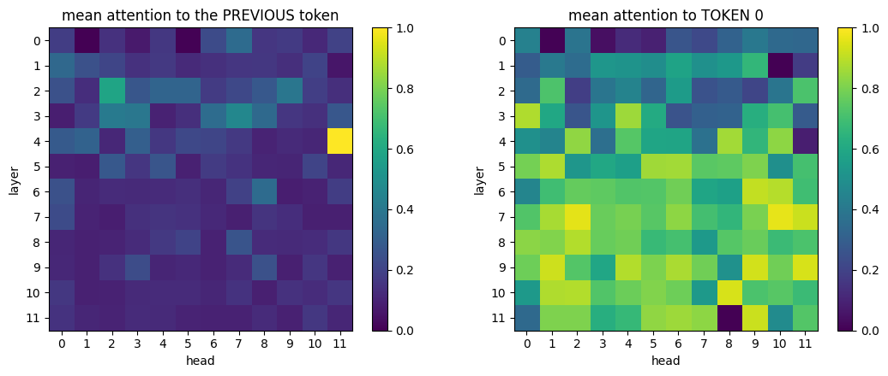
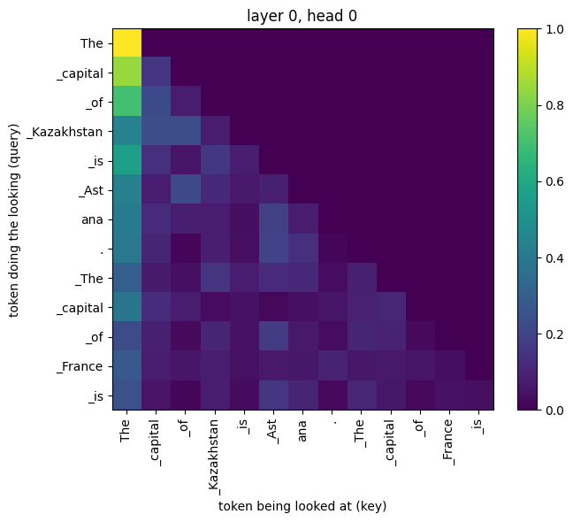
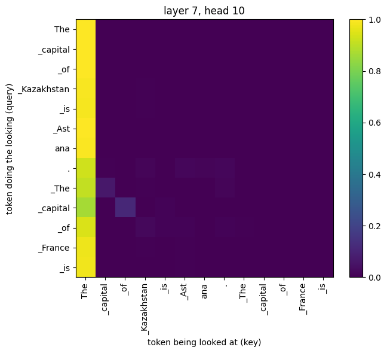

# Lab 02 — Open the box
```
torch 2.11.0+cpu | transformers 5.16.1
parameters      : 124,439,808
vocabulary      : 50,257 tokens
layers x heads  : 12 x 12
embedding table : (50257, 768)  (rows = tokens, columns = numbers per token; 768 is the GPT-2 small figure from slide 10)
```

## Part 0 — a token is not a word
```
'restore': 2 tokens
  ids   : [2118, 382]
  pieces: ['rest', 'ore']
'bank': 1 tokens
  ids   : [17796]
  pieces: ['bank']
'банк': 5 tokens
  ids   : [140, 109, 16142, 22177, 31583]
  pieces: ['Ð', '±', 'а', 'н', 'к']
'бөлімшеңізде': 19 tokens
  ids   : [140, 109, 143, 102, 30143, 141, 244, 43108, 141, 230, 16843, 142, 96, 141, 244, 140, 115, 43666, 16843]
  pieces: ['Ð', '±', 'Ó', '©', 'л', 'Ñ', 'ĸ', 'м', 'Ñ', 'Ī', 'е', 'Ò', '£', 'Ñ', 'ĸ', 'Ð', '·', 'д', 'е']
```

## Part 1 — the output is 50,257 numbers
```
prompt: 'The capital of Kazakhstan is Astana. The capital of France is'   T=1.0
logits shape: (50257,)   probabilities sum to 1.0000
  22.87%   id   8304   ' Ast'
  22.08%   id   6342   ' Paris'
   4.48%   id    262   ' the'
   3.15%   id  18460   ' Nice'
   2.56%   id   4881   ' France'
   2.15%   id  31630   ' Monaco'
   1.97%   id   9281   ' Saint'
   1.95%   id  45996   ' Marse'
   1.51%   id  35193   ' Lyon'
   1.23%   id    347   ' B'
  top-10 hold 64.0%; the other 50,247 tokens share 36.0%
```

```
prompt: 'Once upon a time, there was a'   T=1.0
logits shape: (50257,)   probabilities sum to 1.0000
   4.42%   id    582   ' man'
   3.31%   id   1049   ' great'
   2.20%   id    640   ' time'
   1.54%   id   1728   ' certain'
   1.34%   id   2415   ' woman'
  top-5 hold 12.8%; the other 50,252 tokens share 87.2%

prompt: 'The capital of France is'   T=1.0
logits shape: (50257,)   probabilities sum to 1.0000
   8.46%   id    262   ' the'
   4.79%   id    783   ' now'
   4.62%   id    257   ' a'
   3.24%   id   4881   ' France'
   3.22%   id   6342   ' Paris'
  top-5 hold 24.3%; the other 50,252 tokens share 75.7%

prompt: '2 + 2 ='   T=1.0
logits shape: (50257,)   probabilities sum to 1.0000
  10.19%   id    513   ' 3'
   9.16%   id    352   ' 1'
   8.42%   id    362   ' 2'
   7.52%   id    657   ' 0'
   5.50%   id    604   ' 4'
  top-5 hold 40.8%; the other 50,252 tokens share 59.2%

P(' Paris') = 0.2208
P('Paris')  = 0.000009
```

## Temperature
```
maximum possible entropy (all 50,257 tokens equally likely): 10.825 nats

    T  #1 token      p(#1)   entropy   same #1 as at T=1?
 0.25  ' Ast'       0.5345     0.700   True
  1.0  ' Ast'       0.2287     4.120   True
  2.0  ' Ast'       0.0123     9.114   True
  5.0  ' Ast'       0.0004    10.547   True
```

## Top-p
```
    T   tokens kept by top-p=0.9   p(#1) before   p(#1) after
 0.25                          2         0.5345        0.5351
  1.0                        341         0.2287        0.2541
  5.0                     35,021         0.0004        0.0004

T=0.25  10 samples: [' Ast', ' Ast', ' Paris', ' Ast', ' Ast', ' Ast', ' Paris', ' Paris', ' Ast', ' Paris']
T=1.0   10 samples: [' Siem', ' Ast', ' Paris', ' Monaco', ' Ast', ' Lie', ' Pr', ' Paris', ' Ast', ' Paris']
T=5.0   10 samples: [' Catalyst', ' Shim', ' offline', ' alienation', ' hangs', ' Deutsche', ' Mexico', ' "[', ' Actions', ' stability']
T=1.0   + top-p 0.9: [' Mé', ' Ast', ' Paris', ' Monaco', ' Ast', ' Saint', ' Or', ' Paris', ' Ast', ' Paris']
```

## Part 2 — attention is a table of weights
```
13 tokens: ['The', '_capital', '_of', '_Kazakhstan', '_is', '_Ast', 'ana', '.', '_The', '_capital', '_of', '_France', '_is']
12 layers; each tensor has shape (1, 12, 13, 13) = (batch, heads, query, key)
row sums, layer 0 head 0: [1.0, 1.0, 1.0, 1.0, 1.0, 1.0, 1.0, 1.0, 1.0, 1.0, 1.0, 1.0, 1.0]
```




```
layer 4, head 11: 1.000 of its attention goes to the previous token
layer 2, head 2: 0.585 of its attention goes to the previous token
layer 3, head 7: 0.462 of its attention goes to the previous token
```

```
most extreme head on the RIGHT grid: layer 7, head 10  (mean attention to token 0 = 0.964)
mean attention to token 0, averaged over the 12 heads of each layer:
   [0.25, 0.42, 0.4, 0.52, 0.57, 0.72, 0.71, 0.81, 0.74, 0.79, 0.75, 0.66]

```

## Part 3 — the same model, in Kazakh
```
lang  chars  bytes  tokens  tokens/char  x English
en       36     36       8         0.22       1.00
ru       28     53      31         1.11       3.88
kk       31     59      34         1.10       4.25
```

```
prompt: 'The capital of Kazakhstan is'   T=1.0
logits shape: (50257,)   probabilities sum to 1.0000
   8.98%   id    262   ' the'
   7.63%   id   1363   ' home'
   5.89%   id    257   ' a'
  top-3 hold 22.5%; the other 50,254 tokens share 77.5%
  #1 token as raw text: 'Ġthe'
  greedy, 20 tokens: "The capital of Kazakhstan is the capital of the country's former Soviet Union, and the country's president, Nursultan Nazar"

prompt: 'Столица Казахстана —'   T=1.0
logits shape: (50257,)   probabilities sum to 1.0000
  37.79%   id  12466   ' �'
   2.40%   id    198   '\n'
   2.34%   id    220   ' '
  top-3 hold 42.5%; the other 50,254 tokens share 57.5%
  #1 token as raw text: 'ĠÐ'
  greedy, 20 tokens: 'Столица Казахстана — Столица Казахста'

prompt: 'Қазақстанның астанасы —'   T=1.0
logits shape: (50257,)   probabilities sum to 1.0000
  22.54%   id  12466   ' �'
   4.11%   id    220   ' '
   2.39%   id    198   '\n'
  top-3 hold 29.0%; the other 50,254 tokens share 71.0%
  #1 token as raw text: 'ĠÐ'
  greedy, 20 tokens: 'Қазақстанның астанасы — проссии проссии про'
```
